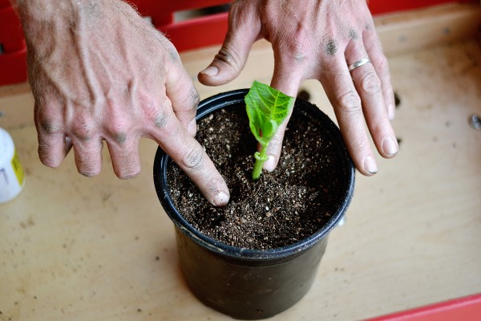

# __How to Propagate Plants__
---
Propagation is growing a plant from a stem or root that has been cut from another plant. Cutting propagation is the easiest and most common method of propagating and almost every landscaping plant can be propagated using this method.

>WARNING: Scissors used incorrectly may cause harm to user, or cause damage to plant.
### Materials Needed:
-  Scissors
- An existing healthy plant
- Jar or container
- Water

## Steps
---
1. Choose plant for cuttings
    - Avoid plants with diseases or lots of drooping, dying foliage.
    - The best plant will have plenty of new growth.
    - The parent plant should be large enough that taking cuttings will not harm it.
3. Find the best stems for cutting
    - Choose green, non-woody stems for cutting.
    - Look for a stem with a node, or a bump along the stem where a leaf or flower bud attaches.
     
4. Take the plant cutting
    - Use a pair of clean scissors to make a clean cut just below a node. 
5. Prepare the cutting
    - Make a clean, partial slice through the middle of the node. 
    - This will increase the chances of roots emerging from this spot. 
6. Rooting
    - After you have cut the plant place, the node in a jar or container of water.
    
    - Using water instead of planting them directly into soil will allow you to keep an eye on the root growth.
7. Monitor the cutting
    - Keep the container in a warm spot and indirect sunlight.
    - Only change the water if begins to look dirty, or if a lot has evaporated.
    - Once plants have substaintial root system they are ready to be potted.
    - Transplant the cutting into its own pot with soil or into the ground.
    

[//]: # (These are reference links used in the body of this note and get stripped out when the markdown processor does its job. There is no need to format nicely because it shouldn't be seen. Thanks SO - http://stackoverflow.com/questions/4823468/store-comments-in-markdown-syntax)

   [dill]: <https://github.com/joemccann/dillinger>
   [git-repo-url]: <https://github.com/joemccann/dillinger.git>
   [john gruber]: <http://daringfireball.net>
   [df1]: <http://daringfireball.net/projects/markdown/>
   [markdown-it]: <https://github.com/markdown-it/markdown-it>
   [Ace Editor]: <http://ace.ajax.org>
   [node.js]: <http://nodejs.org>
   [Twitter Bootstrap]: <http://twitter.github.com/bootstrap/>
   [jQuery]: <http://jquery.com>
   [@tjholowaychuk]: <http://twitter.com/tjholowaychuk>
   [express]: <http://expressjs.com>
   [AngularJS]: <http://angularjs.org>
   [Gulp]: <http://gulpjs.com>

   [PlDb]: <https://github.com/joemccann/dillinger/tree/master/plugins/dropbox/README.md>
   [PlGh]: <https://github.com/joemccann/dillinger/tree/master/plugins/github/README.md>
   [PlGd]: <https://github.com/joemccann/dillinger/tree/master/plugins/googledrive/README.md>
   [PlOd]: <https://github.com/joemccann/dillinger/tree/master/plugins/onedrive/README.md>
   [PlMe]: <https://github.com/joemccann/dillinger/tree/master/plugins/medium/README.md>
   [PlGa]: <https://github.com/RahulHP/dillinger/blob/master/plugins/googleanalytics/README.md>
